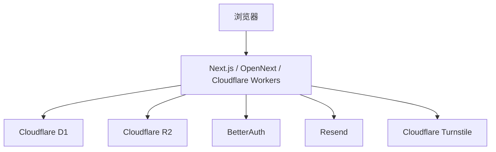

# 架构说明

## 总体结构



## 主要目录

```text
src/app          页面与接口
src/components   前台与后台组件
src/lib          配置、认证、邮件、数据库逻辑
src/drizzle      数据表与迁移
public           站点标识图、浏览器图标、占位图
docs             中文文档
```

## 配置入口

- `src/lib/site-config.ts`：站点级占位信息
- `wrangler.jsonc`：Cloudflare 部署绑定与公开路由
- `.env.local`、`.dev.vars`：本地私有配置

## 当前占位资源

- 站点标识图：`public/logos/template-logo.svg`
- 浏览器图标：`public/favicon.svg`
- 产品卡占位图：`public/placeholders/product-card.svg`
- 场景占位图：`public/placeholders/catalog-scene.svg`

## 发布前检查点

- 域名与公开路由是否已替换
- 邮箱与管理员白名单是否已替换
- 对象存储公开地址是否已替换
- 页面元信息与对外文案是否已替换
