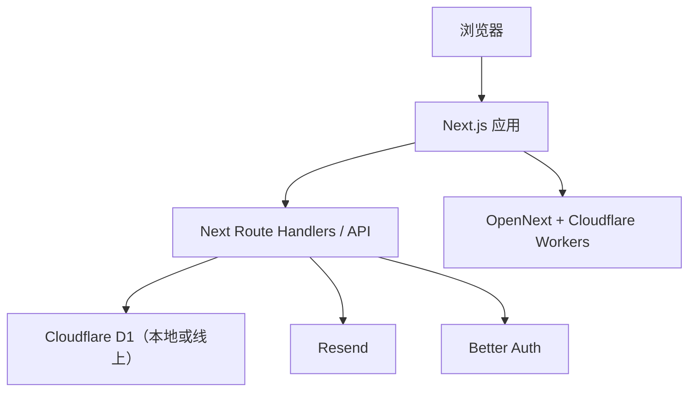

# 架构说明

这份文档只讲“你应该怎样理解这个模板”，不展开源码细节。

## 一句话理解

这是一个基于 Next.js 的模板网站，前台页面、后台页面、接口、数据库和部署骨架都在一个仓库里。

## 总体结构



## 线索归因链路

现在的询盘归因走服务端会话，不再由前端拼完整 tracking JSON。

- 浏览器访问页面时，`VisitorTracker` 只向 `/api/visit` 上报当前 path
- 服务端依据 path、referer、请求头和 Cloudflare `cf` 信息生成或更新 attribution session
- `session_id` / `visitor_id` 通过 `httpOnly cookie` 保存
- Contact / Inquiry 提交时，接口从服务端 session 取回 tracking 快照
- 线索落库、邮件通知、后台线索中心、Google Ads feed 都消费这份服务端 tracking 快照

这样前端请求里不再携带完整归因 JSON，但邮件和后台仍能看到来源、UTM、点击 ID、落地页和访问路径。

## 你最需要知道的 3 种运行状态

### 1. 模板预览模式

默认就是这个模式。

特点：

- 使用 mock data
- 前后台都能演示
- 不依赖真实品牌资料
- 不应该主动打真实业务接口

### 2. 本地 D1 持久化模式

当你执行 `pnpm db:local:setup` 后，本地会有一个可持久化的 D1 数据库。

特点：

- 后台设置能保留
- 线索中心 mock 数据能保留
- 更适合本地演示和反复改站

### 3. 生产模式

你真正上线时才会进入这个阶段。

特点：

- 需要真实域名
- 需要真实 Cloudflare 绑定
- 需要真实登录、邮件和环境变量

## 主要目录

```text
src/app
  前台页面、后台页面、API 路由

src/components
  页面用到的 React 组件

src/lib
  配置、认证、邮件、数据库、mock 数据逻辑

src/drizzle
  D1 数据表和 SQL 迁移

public
  logo、favicon、占位图等静态资源

docs
  给人和 AI 看的说明文档
```

## 关键入口文件

- `src/lib/site-config.ts`
  站点基础信息和模板占位值
- `src/app/`
  页面和接口入口
- `src/drizzle/`
  数据结构和迁移
- `wrangler.jsonc`
  Cloudflare 部署配置
- `.env.local`、`.dev.vars`
  本地私有配置

## 模板默认占位资源

- logo：`public/logos/template-logo.svg`
- favicon：`public/favicon.svg`
- 产品占位图：`public/placeholders/product-card.svg`
- 场景占位图：`public/placeholders/catalog-scene.svg`

## 对 AI 最重要的边界

- 默认保持 mock data，不要擅自替换成真实客户数据
- 没有明确要求时，不要把模板站直接改成依赖真实第三方服务
- 优先从 `site-config`、页面文案、logo、favicon、产品展示结构开始改

- 域名与公开路由是否已替换
- 邮箱与管理员白名单是否已替换
- 对象存储公开地址是否已替换
- 页面元信息与对外文案是否已替换
